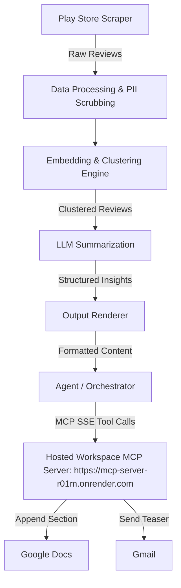

# Weekly Product Review Pulse — Architecture

This document outlines the detailed architecture for the automated Weekly Product Review Pulse system, specifically tailored for the Groww platform using Google Play Store reviews and delivered via a custom MCP server.

## 1. System Overview
The Weekly Product Review Pulse is an automated orchestration pipeline that ingests public reviews, clusters them into actionable themes using machine learning, and delivers a concise one-page insight report to stakeholders. The system relies entirely on a custom Model Context Protocol (MCP) server for its interactions with Google Workspace (Docs and Gmail).

## 2. High-Level Architecture Diagram

## 3. Core Components

### 3.1 Data Ingestion & Safety
* **Play Store Scraper:** A module responsible for fetching public reviews for the Groww app from the Google Play Store over a configurable window (e.g., last 8–12 weeks).
* **Quality Gating:** A filtering pipeline that removes low-quality reviews (e.g., under 8 words, containing emojis, or non-English). This ensures only descriptive, semantic-rich reviews reach the clustering engine.
* **PII Scrubbing:** Before any processing or reasoning occurs, raw review text is scrubbed of Personally Identifiable Information (PII) to ensure data privacy and compliance.
* **Output Artifacts:** The ingestion system generates two separate outputs:
  * `raw_reviews.json` — Stores all raw scraped reviews and all metadata fields.
  * `reviews.json` — Stores the processed, normalized, and PII-scrubbed reviews used as downstream inputs.

### 3.2 Reasoning Engine
* **Embeddings & Clustering:** Text embeddings are generated locally using the `BAAI/bge-small-en-v1.5` model (via `SentenceTransformer`). Dimensionality reduction is performed with `UMAP`, and density-based clustering is handled via `HDBSCAN` to group semantically similar reviews.
* **LLM Summarization:** An LLM processes the clustered feedback using the Groq API with the `llama-3.3-70b-versatile` model to:
  * Name overarching themes (e.g., "App performance & bugs").
  * Extract representative, verbatim quotes. For multi-topic reviews, extract only the sentence relevant to the specific cluster theme.
  * Propose actionable ideas for product and support teams.
* **Constraints & Validation:**
  * **Rate Limiting:** Implements token-aware sampling (max 15 reviews per cluster) and delay throttling (5-second delay between calls) to stay within Groq's limits: 30 RPM, 1K RPD, 12K TPM, 100K TPD.
  * **Verbatim Verification:** Programmatically validates that LLM-extracted quotes exist word-for-word in the original reviews to prevent hallucinations.

### 3.3 Output Generation
* **Report Renderer:** Converts the structured output from the LLM into a well-formatted narrative suitable for Google Docs.
* **Email Renderer:** Creates a brief, stakeholder-friendly teaser (e.g., top 3 bullet points) designed for Gmail.

### 3.4 Custom MCP Server (Delivery)
The project connects to a hosted Custom Workspace MCP Server (at `https://mcp-server-r01m.onrender.com`) to handle all external workspace mutations. The agent codebase does not embed Google credentials or call Google APIs directly. Instead, it interacts with the hosted server via the Model Context Protocol using SSE transport.
* **Google Docs MCP:** Exposes tools to append a new dated section to a single, running document (e.g., "Weekly Review Pulse — Groww"). This document serves as the system of record.
* **Gmail MCP:** Exposes tools to draft or send a short email. The email includes a deep link directly to the newly created section in the Google Doc.

## 4. Operational Characteristics

### 4.1 Orchestration & Scheduling
* **Weekly Cadence:** The agent pipeline is designed to be triggered as a scheduled job (e.g., Monday morning IST).
* **CLI Interface:** A command-line interface allows for manual triggering and backfilling of data for any specific ISO week.

### 4.2 Idempotency & Reliability
Re-running the pipeline for the same ISO week must not result in duplicate reports or emails.
* **Stable Anchors:** The system uses a stable heading or section anchor in the Google Doc to verify if the week's report already exists.
* **Run-scoped Idempotency Check:** The Gmail delivery utilizes a run-scoped identifier (e.g., week number + year + product) to ensure the email is only sent once per period.

### 4.3 Auditing
Each run logs essential metadata:
* Timestamp of the run.
* The ISO week processed.
* The specific delivery identifiers (Google Doc heading ID, Gmail message ID).
* Cost/token limits and consumption metrics for the LLM.
